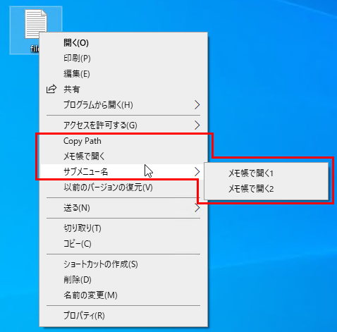
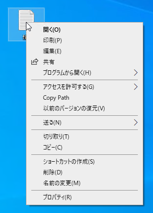
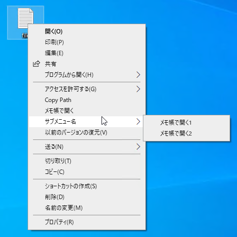

# pathcopyextension
 
## 概要

エクスプローラーの右クリックメニューを拡張します。`pathcopyextension.dll`と同じフォルダにある`setting.xml`を編集することでメニューを追加することができます。

  

## 機能説明

### 標準機能
「Copy Path」メニューが追加されます（後述の通り、無効化可能）。メニューを選択するとクリップボードにファイル/フォルダパスをコピーします。  

  

`setting.xml`を編集することで「Copy Path」の無効化や動作変更が可能です。  

```xml
<?xml version="1.0" encoding="utf-8"?>
<menus>
    <copypath>
        <enable>true</enable>
        <doublequotationmark>false</doublequotationmark>
        <lastNewLine>false</lastNewLine>
    </copypath>
</menus>
```

`<enable>` : 「Copy Path」メニューの有効無効(表示有無)を設定します。  
`<doublequotationmark>` : パスをコピーするときに""で囲うかどうかを設定します。  
`<lastNewLine>` : 最後に改行を挿入するかどうかを設定します。  


### 拡張子別のメニューを追加する機能

`setting.xml`を編集することで拡張子毎に自分で設定したメニューを追加することができます。例えば拡張子が`.txt`のファイルに独自のメニューを追加する場合、  

```xml
<?xml version="1.0" encoding="utf-8"?>
<menus>
  <copypath>
    <enable>true</enable>
    <doublequotationmark>false</doublequotationmark>
    <lastNewLine>false</lastNewLine>
  </copypath>
  <extmenu ext=".txt">
    <button>
      <name>メモ帳で開く</name>
      <command>notepad.exe</command>
      <arg>__file__</arg>
      <each>true</each>
    </button>
    <menu name="サブメニュー名">
      <button>
        <name>メモ帳で開く1</name>
        <command>notepad.exe</command>
        <arg>__file__</arg>
        <each>true</each>
      </button>
      <button>
        <name>メモ帳で開く2</name>
        <command>notepad.exe</command>
        <arg>__file__</arg>
        <each>false</each>
      </button>
    </menu>
  </extmenu>
</menus>
```
  


`<command>`  
  * 実行ファイルを指定します。  
  * `.\`で始まる場合は`pathcopyextension.dll`のあるフォルダに置き換えられます。例えば`.\app.bat`であれば`pathcopyextension.dll`と同じフォルダにある`app.bat`が実行されます。  

`<arg>`  
  * 実行時の引数を指定します。  
  * `__file__`は呼び出されたファイルパスに置き換わります。ファイルパスに空白がある場合は""で囲みます。
  

`<each>`  
  * 複数ファイル選択時、ファイル毎に実行するかまとめて実行するかを設定します。  
  * trueの場合は個々のファイル毎に実行され、falseの場合はまとめて実行されます。  

上記の場合、`a.txt` `b.txt` `c 1.txt`が選択された状態でメモ帳で開くメニューを選ぶと、`notepad.exe a.txt` `notepad.exe b.txt` `notepad.exe "c 1.txt"`が実行されます。`<each>`をfalseに設定した場合は、`notepad.exe a.txt b.txt "c 1.txt"`が実行されます。  


## インストール、アンインストール方法

**バッチファイルを利用する場合**  

* `pathcopyextension.dll`と同じフォルダに`install_uninstall.bat`をコピーします。  
* `install_uninstall.bat`を右クリックして「管理者として実行」を選択します。  
*  表示に従ってインストール/アンインストールします。  

**バッチファイルを利用しない場合**  

  インストール  
   ```bat
   RegAsm.exe /codebase pathcopyextension.dll
   ```

  アンインストール  
   ```bat
   RegAsm.exe /u pathcopyextension.dll
   ```

## 動作確認環境
Microsoft Windows10 x64 + .NET Framework 4.8


## SharpShellについて

本ソフトウェアは SharpShell を使用しています。  
ライセンスについては SharpShell フォルダ内のLICENSE.mdを確認願います。  

SharpShell 2.7.2  
Copyright (c) 2014 Dave Kerr  
https://github.com/dwmkerr/sharpshell  
